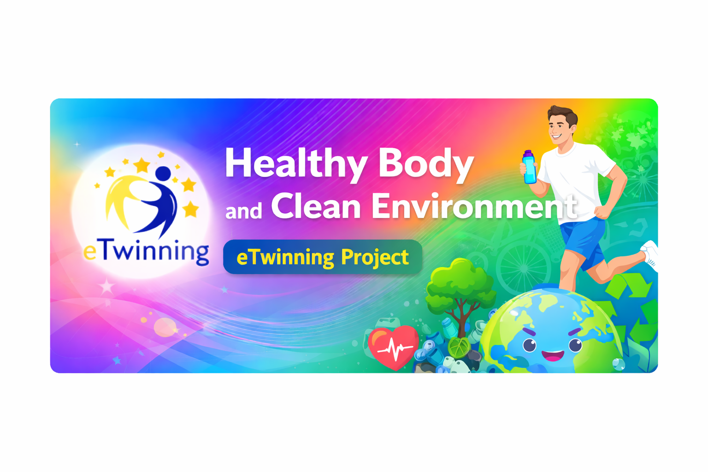
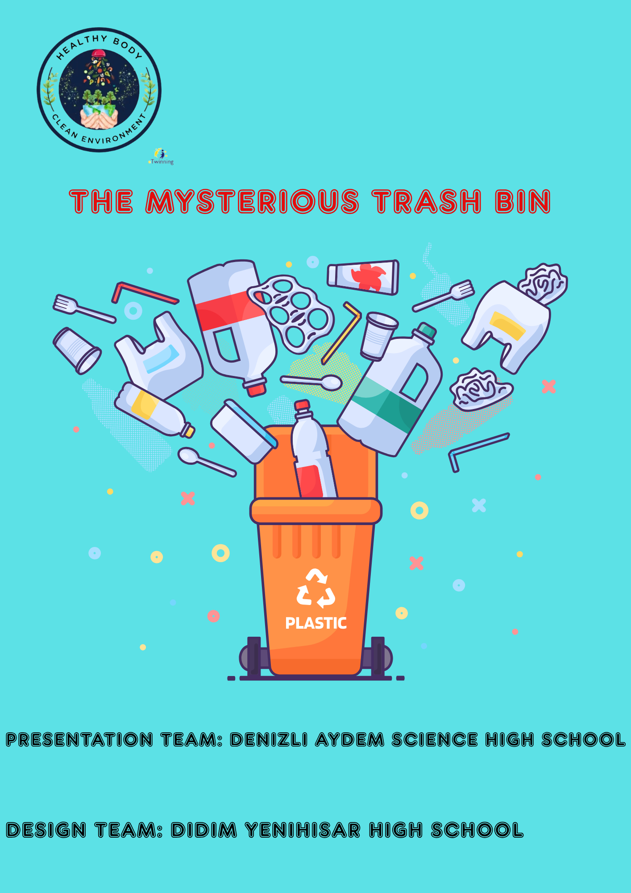
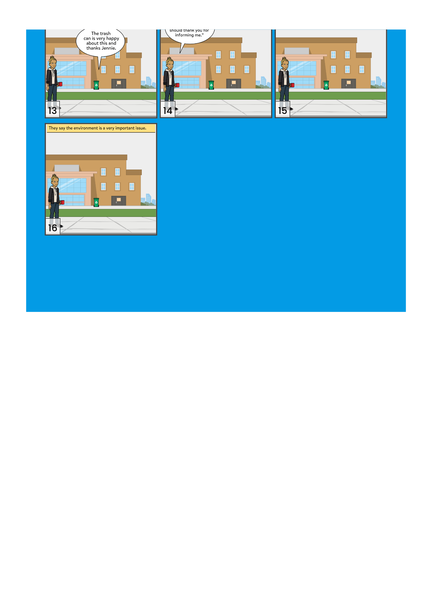
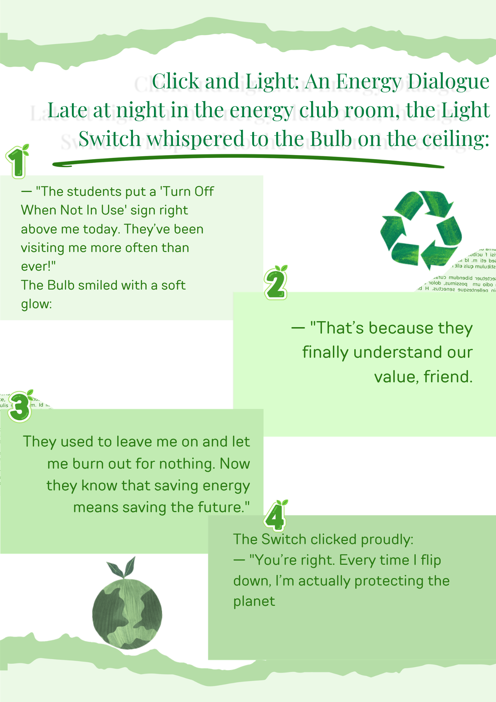
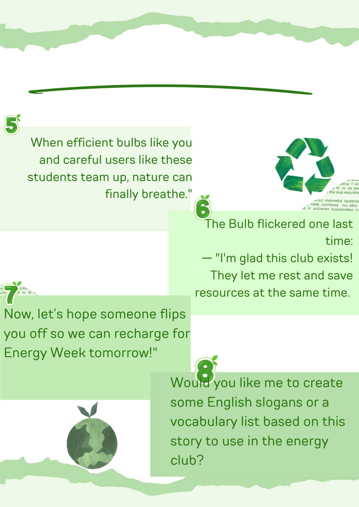
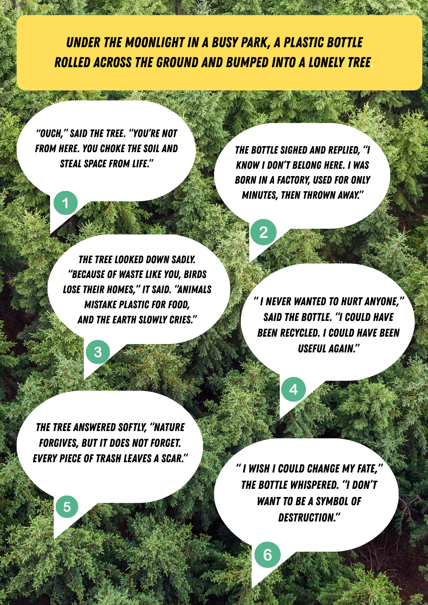
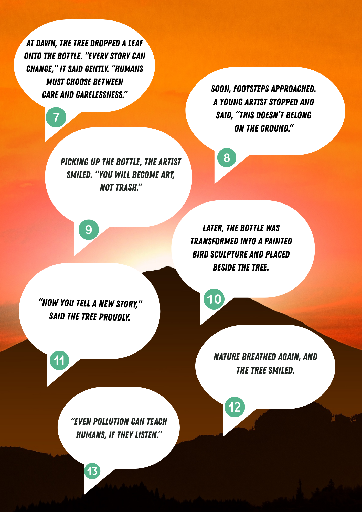

README.md

 

🌱 Healthy Body and Clean Environment

 🌍 eTwinning Project

 🇹🇷 Proje Hakkında
Bu proje, öğrencilerde sağlıklı yaşam alışkanlıkları ve çevre bilinci oluşturmayı amaçlamaktadır.  
eTwinning kapsamında yürütülen uluslararası bir projedir.

 🎯 Amaçlarımız
- 🥗 Sağlıklı yaşam bilinci kazandırmak  
- ♻️ Çevre temizliği konusunda farkındalık oluşturmak  
- 🌱 Geri dönüşüm alışkanlıklarını geliştirmek  
- 🤝 Uluslararası iş birliği sağlamak  

 📂 İçerikler

| Bölüm | Açıklama |
|------|--------|
| 📸 Fotoğraflar | Proje etkinlik görselleri |
| 🗂 Aktiviteler | Yapılan çalışmalar |
| 📅 Timeline | Süreç takibi |
| 🧑‍🎓 Öğrenci çalışmaları | Ürünler |
| 📊 Anketler | Değerlendirmeler |

 💚 Slogan
“Sağlıklı birey, temiz çevre!

🌍 English

 About the Project
This project aims to promote healthy lifestyle habits and environmental awareness among students.  
It is an international project carried out within eTwinning.

 🎯 Objectives
- Promote healthy lifestyle habits  
- Raise environmental awareness  
- Develop recycling habits  
- Ensure international collaboration  

 💚 Motto
“Healthy individuals, clean environment!”

📂 Contents

Section	Description
📸 Photos	Project event visuals
🗂 Activities	Activities carried out
📅 Timeline	Process tracking
🧑‍🎓 Student Work	Outputs / Products
📊 Surveys	Evaluations

## 📸 Project Photos

  
  
  

  
  
  

  
  
  

  
  

🤝 Project Partners

This project is carried out in collaboration with the following schools:

🇹🇷 Turkey
- Haydarpaşa High School  
- Aydem Science High School  
- Ankara TVF Sports High School  
- Gönen Science High School  
- Kırıkkale Atatürk Anatolian High School  
- Didim Yenihisar Anatolian High School  
- Artuklu Anatolian Imam Hatip High School  
- Private MEF High School  
- Şehit Gültekin Tırpan Vocational and Technical Anatolian High School  

 🇷🇴 Romania
- Liceul "Regina Maria"  
- Nicolae Titulescu High School Medgidia  
- Liceul Tehnologic "Dimitrie Bolintineanu
  
 🇭🇷 Croatia
- Srednja Skola Zlatar  

 🇱🇻 Latvia
- Zemgale Secondary School

Project Videos

Here is our activity video:

